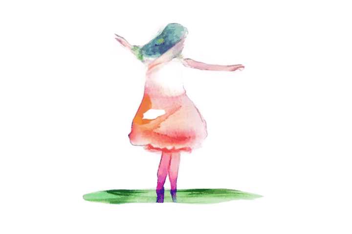

<h1 style="display: inline-block;">
    
    Mobius: Text to Seamless Looping Video Generation via Latent Shift
</h1>

<b><a href='https://bixiuli.github.io/'> Xiuli Bi</a> · Jianfei Yuan · <a href='https://scholar.google.com/citations?user=fXlz210AAAAJ&hl=zh-CN'>Bo Liu</a> · <a href='https://yzhang2016.github.io/'>Yong Zhang</a> · <a href='https://vinthony.github.io'>Xiaodong Cun</a> · <a href='https://cmpun.github.io/'>Chi-Man Pun</a> · <a href='https://scholar.google.com/citations?hl=zh-TW&user=e3Dw1bkAAAAJ'>Bin Xiao</a></b>


[]() [](https://mobius-diffusion.github.io/) 


## 🔮 Latest Update

- [27/2/2025] 🔥 We released the **[Mobius Paper](https://arxiv.org/abs/2312.16476)**. Mobius is a novel method to generate seamlessly looping videos from text descriptions directly without any user annotations.

<!-- ## 📌 Installation Guide

### 🛠️ Step 1:


### 🛠️ Step 2:  -->

<!-- ## 🎥 Video -->


## 🎬 Gallery

### 🧸 Animal
<table border="0" style="width: 100%; text-align: center;">
  <tr>
    <td width="30%">
      
    </td>
    <td width="30%">
      
    </td >
    <td width="30%">
      
    </td>
  </tr>
  <tr>
    <td>
      <p>Prompt: A lone wolf stands atop a snowy hill, howling beneath a starry sky in a frozen forest...</p>
    </td>
    <td>
      <p>Prompt: A majestic dragon soars through the sky, its massive wings outstretched against the fiery colors of a setting sun...</p>
    </td>
    <td>
      <p>Prompt: A cat stretches lazily in the warm sunlight streaming through an open window, its fur glowing in the golden light...</p>
    </td>
  </tr>
    
</table>


### 🧩 Environment
<table border="0" style="width: 100%; text-align: center;">
  <tr>
    <td width="30%">
      
    </td>
    <td width="30%">
      
    </td>
    <td width="30%">
      
    </td>
  </tr>
  <tr>
    <td>
      <p>
        Prompt: Small raindrops create rhythmic ripples in a puddle, their concentric circles merging seamlessly...
    </td>
    <td>
        <p>
            Prompt: White-capped waves roll forward and crash dramatically against jagged rocks, sending spray into the air...
        </p>
    </td>
    <td>
        <p>
            Prompt: Stars twinkle in the vast expanse of space as a galaxy rotates slowly in the distance...
    </td>
  </tr>
</table>

### 🎠 Cartoon
<table border="0" style="width: 100%; text-align: center;">
  <tr>
    <td width="30%">
      
    </td>
    <td width="30%">
      
    </td>
    <td width="30%">
      
    </td>
  </tr>
  <tr>
    <td>
      <p>Prompt: A mischievous raccoon sneaks through a pile of cartoonish leaves in a city park...</p>
    </td>
    <td>
      <p>Prompt: A group of adorable animals, including a talking squirrel, a rabbit in glasses, and a wise owl,...</p>
    </td>
    <td>
      <p>Prompt: A young wizard in a colorful purple robe waves a wand, creating sparkling cartoonish magic...</p>
    </td>
  </tr>
</table>

### 🎨 Watercolor
<table border="0" style="width: 100%; text-align: center;">
  <tr>
    <td width="30%">
      
    </td>
    <td width="30%">
      
    </td>
    <td width="30%">
      
    </td>
  </tr>
  <tr>
    <td width="30%">
      <p>Prompt: A fox moves through the forest, its body sleek and agile as it glides over the ground...</p>
    </td>
    <td width="30%">
      <p>Prompt: A horse gallops through a golden wheat field, its mane and tail flowing in the wind...</p>
    </td>
    <td width="30%">
      <p>Prompt: A child dances joyfully in an open field, her arms outstretched as she spins in circles...</p>
    </td>
  </tr>
</table>

### 🥽 Cyberpunk
<table border="0" style="width: 100%; text-align: center;">
  <tr>
    <td width="30%">
      
    </td>
    <td width="30%">
      
    </td>
    <td width="30%">
      
    </td>
  </tr>
  <tr>
    <td>
      <p>Prompt: A cyberpunk courier in a sleek, urban jumpsuit speeds through a glowing metropolis on a hoverbike,...</p>
    </td>
    <td>
      <p>Prompt: A woman with bright neon hair dances in the middle of a crowded street, her body moving to the rhythm of the city...</p>
    </td>
    <td>
      <p>Prompt: A cyberpunk smuggler leans over a glowing console inside their hovercraft, the heads-up display scanning cargo containers...</p>
    </td>
  </tr>
</table>

<!-- ## 📋 TODO

- [x] Release the paper.
- [ ] Release the code. -->


## :paperclip: Citation

If you use this code for your research, please cite the following work:

```
@article{2025mobius,
    author    = {Bi, Xiuli and Yuan, Jianfei and Liu, Bo and Zhang, Yong and Cun, Xiaodong and Pen, Chi-Man and Xiao, Bin},
    title     = {Mobius: Text to Seamless Looping Video Generation via Latent Shift},
    booktitle = {arxiv},
    year      = {2025},
```

## :copyright: Licence

This work is licensed under a MIT License.
