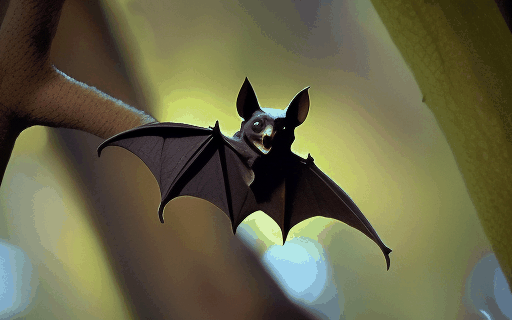
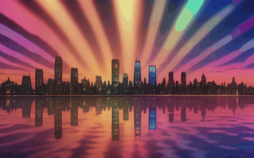

<h1 style="display: inline-block;">
    
    Mobius: Text to Seamless Looping Video Generation via Latent Shift
</h1>

<b><a href='https://bixiuli.github.io/'> Xiuli Bi</a> · Jianfei Yuan · <a href='https://scholar.google.com/citations?user=fXlz210AAAAJ&hl=zh-CN'>Bo Liu</a> · <a href='https://yzhang2016.github.io/'>Yong Zhang</a> · <a href='https://vinthony.github.io'>Xiaodong Cun 📪</a> · <a href='https://cmpun.github.io/'>Chi-Man Pun</a> · <a href='https://scholar.google.com/citations?hl=zh-TW&user=e3Dw1bkAAAAJ'>Bin Xiao</a></b>


[](https://arxiv.org/abs/2502.20307) [](https://mobius-diffusion.github.io/) 


<div style="display: flex;">
    <div style="width: 50%;">
        
    </div>
    <div style="width: 50%;">
        
    </div>
</div>


## 🔮 Latest Update

- [17/3/2025] 🚀🚀🚀 We released **mobius code** based on CogVideoX. We also released **mobius-vc2 code** based on VideoCrafter2 and more cases!
- [27/2/2025] 🔥🔥🔥 We released the **[Mobius Paper](https://arxiv.org/abs/2502.20307)**. Mobius is a novel method to generate seamlessly looping videos from text descriptions directly without any user annotations.

## 📌 Installation Guide

### 💡 1. Clone our repository

```
git clone git@github.com:YisuiTT/Mobius.git
cd Mobius
```

### ☀️ 2. Start with <a href="https://github.com/THUDM/CogVideo">CogVideoX</a>

#### ⚙️ 2.1 Environment Setup
```
conda create -n mobius python=3.10
conda activate mobius

pip install -r requirements.txt
```

#### 🤗 2.2 Download the models from Hugging Face
|Model|Resolution|Checkpoint
|:----|:---------|:---------
|CogVideoX-5b|720x480|[Hugging Face](https://huggingface.co/THUDM/CogVideoX-5b/tree/main)

#### 🚀 2.3 Inference with CogVideoX

```
python mobius_cli_demo.py --prompts_path "./prompts/samples.txt" --model_path /path/to/your_models_path/CogVideoX-5b --output_path "./results/samples" --shift_skip 6 --frame_invariance_decoding
```
💎Parameter:
- `prompts_path`(str): The path to the description of the video to generate.
- `model_path`(str): The path of the pre-trained model to be used.
- `output_path`(str): The path where the generated video will be saved.
- `shift_skip`(int): Set the skip step of latent shift.
- `frame_invariance_decoding`(bool): Enable or disable frame-invariance decoding.

#### 👑 2.4 Run Gradio Demo

```
python gradio_web_demo.py
```
💍Tips:

Set the following environment variables in your system:

+ MODEL_PATH = your_models_path


### 🌑 3. Start with <a href="https://github.com/AILab-CVC/VideoCrafter">VideoCrafter2</a>

#### ⚙️ 2.1 Environment Setup
```
conda create -n mobius_vc2 python=3.8.5
conda activate mobius_vc2

pip install torch==2.4.1 torchvision==0.19.1 torchaudio==2.4.1 --index-url https://download.pytorch.org/whl/cu121
pip install -r requirements_vc2.txt
```

#### 🤗 2.2 Download the models from Hugging Face
|Model|Resolution|Checkpoint
|:----|:---------|:---------
|VideoCrafter2 (Text2Video)|512x320|[Hugging Face](https://huggingface.co/VideoCrafter/VideoCrafter2/tree/main)

#### 🚀 2.3 Inference with VideoCrafter2

```
python mobius_vc2_demo.py --prompt_file "prompts/samples.txt" --ckpt_path /path/to/your_models_path/VideoCrafter2/model.ckpt --savedir "results_vc2/samples" --shift_skip 9
```
💎Parameter:
- `prompt_file`(str): The path to the description of the video to generate.
- `ckpt_path`(str): The path of the pre-trained model to be used.
- `savedir`(str): The path where the generated video will be saved.
- `shift_skip`(int): Set the skip step of latent shift.


## 🎬CogVideoX Gallery

### 🧸 Animal
<table border="0" style="width: 100%; text-align: center;">
  <tr>
    <td width="30%">
      
    </td>
    <td width="30%">
      
    </td >
    <td width="30%">
      
    </td>
  </tr>
  <tr>
    <td>
      <p>Prompt: A lone wolf stands atop a snowy hill, howling beneath a starry sky in a frozen forest...</p>
    </td>
    <td>
      <p>Prompt: A majestic dragon soars through the sky, its massive wings outstretched against the fiery colors of a setting sun...</p>
    </td>
    <td>
      <p>Prompt: A cat stretches lazily in the warm sunlight streaming through an open window, its fur glowing in the golden light...</p>
    </td>
  </tr>
    
</table>


### 🧩 Environment
<table border="0" style="width: 100%; text-align: center;">
  <tr>
    <td width="30%">
      
    </td>
    <td width="30%">
      
    </td>
    <td width="30%">
      
    </td>
  </tr>
  <tr>
    <td>
      <p>
        Prompt: Small raindrops create rhythmic ripples in a puddle, their concentric circles merging seamlessly...
    </td>
    <td>
        <p>
            Prompt: White-capped waves roll forward and crash dramatically against jagged rocks, sending spray into the air...
        </p>
    </td>
    <td>
        <p>
            Prompt: Stars twinkle in the vast expanse of space as a galaxy rotates slowly in the distance...
    </td>
  </tr>
</table>

### 🎠 Cartoon
<table border="0" style="width: 100%; text-align: center;">
  <tr>
    <td width="30%">
      
    </td>
    <td width="30%">
      
    </td>
    <td width="30%">
      
    </td>
  </tr>
  <tr>
    <td>
      <p>Prompt: A mischievous raccoon sneaks through a pile of cartoonish leaves in a city park...</p>
    </td>
    <td>
      <p>Prompt: A group of adorable animals, including a talking squirrel, a rabbit in glasses, and a wise owl,...</p>
    </td>
    <td>
      <p>Prompt: A young wizard in a colorful purple robe waves a wand, creating sparkling cartoonish magic...</p>
    </td>
  </tr>
</table>

### 🎨 Watercolor
<table border="0" style="width: 100%; text-align: center;">
  <tr>
    <td width="30%">
      
    </td>
    <td width="30%">
      
    </td>
    <td width="30%">
      
    </td>
  </tr>
  <tr>
    <td width="30%">
      <p>Prompt: A horse gallops through a golden wheat field, its mane and tail flowing in the wind...</p>
    </td>
    <td width="30%">
      <p>Prompt: A fox moves through the forest, its body sleek and agile as it glides over the ground...</p>
    </td>
    <td width="30%">
      <p>Prompt: A child dances joyfully in an open field, her arms outstretched as she spins in circles...</p>
    </td>
  </tr>
</table>

### 🥽 Cyberpunk
<table border="0" style="width: 100%; text-align: center;">
  <tr>
    <td width="30%">
      
    </td>
    <td width="30%">
      
    </td>
    <td width="30%">
      
    </td>
  </tr>
  <tr>
    <td>
      <p>Prompt: A cyberpunk courier in a sleek, urban jumpsuit speeds through a glowing metropolis on a hoverbike,...</p>
    </td>
    <td>
      <p>Prompt: A woman with bright neon hair dances in the middle of a crowded street, her body moving to the rhythm of the city...</p>
    </td>
    <td>
      <p>Prompt: A cyberpunk smuggler leans over a glowing console inside their hovercraft, the heads-up display scanning cargo containers...</p>
    </td>
  </tr>
</table>


## 🎬VideoCrafter2 Gallery
### 🧑‍🚀 Human
<table border="0" style="width: 100%; text-align: center;">
  <tr>
    <td width="30%">
      
    </td>
    <td width="30%">
      
    </td>
    <td width="30%">
      
    </td>
  </tr>
  <tr>
    <td>
      <p>Prompt: A rugged man in a sleek, insulated black ski jacket and matching ski pants glides effortlessly down a pristine,...</p>
    </td>
    <td>
      <p>Prompt: A woman in a flowing, white sundress and sunglasses, her hair tousled by the sea breeze, runs along a golden sandy beach...</p>
    </td>
    <td>
      <p>Prompt: A hacker, surrounded by holographic screens, works feverishly in a dimly lit, tech-heavy room. The digital interference...</p>
    </td>
  </tr>
</table>

### 🧸 Animal
<table border="0" style="width: 100%; text-align: center;">
  <tr>
    <td width="30%">
      
    </td>
    <td width="30%">
      
    </td>
    <td width="30%">
      
    </td>
  </tr>
  <tr>
    <td>
      <p>Prompt: A majestic dragon soars through the sky, its massive wings outstretched against the fiery colors of a setting sun...</p>
    </td>
    <td>
      <p>Prompt: A small crab, its vibrant orange and red shell glistening under the soft aquarium lights, scuttles across the smooth,...</p>
    </td>
    <td>
      <p>Prompt: A small bat, its wings delicately folded, hangs upside down from a tree branch in the dim light of the evening...</p>
    </td>
  </tr>
</table>


### 🧩 Environment
<table border="0" style="width: 100%; text-align: center;">
  <tr>
    <td width="30%">
      
    </td>
    <td width="30%">
      
    </td>
    <td width="30%">
      
    </td>
  </tr>
  <tr>
    <td>
      <p>Prompt: Brilliant fireworks explode in the night sky, scattering trails of red, blue, and gold. The camera zooms in on...</p>
    </td>
    <td>
      <p>Prompt: White-capped waves roll forward and crash dramatically against jagged rocks, sending spray into the air...</p>
    </td>
    <td>
      <p>Prompt: Lights from a vibrant city skyline shimmer on a rippling waterfront, reflecting a kaleidoscope of colors...</p>
    </td>
  </tr>
</table>

## 📋 TODO

- [x] Release the paper.
- [x] Release the code based on CogVideoX-5b.
- [x] Release the code based on VideoCrafter2
- [ ] Longer looping and RoPE-interp code.

## :paperclip: Citation

If you use this code for your research, please cite the following work:

```
@article{2025mobius,
    author    = {Bi, Xiuli and Yuan, Jianfei and Liu, Bo and Zhang, Yong and Cun, Xiaodong and Pen, Chi-Man and Xiao, Bin},
    title     = {Mobius: Text to Seamless Looping Video Generation via Latent Shift},
    booktitle = {arxiv},
    year      = {2025},
```

## :books: Acknowledgements
The project is built based on the following repository:

- [THUDM/CogVideoX](https://github.com/THUDM/CogVideo)
- [AILab-CVC/VideoCrafter](https://github.com/AILab-CVC/VideoCrafter)

Thanks to the authors for sharing their awesome codebases!


## :copyright: Licence

This work is licensed under a MIT License.
